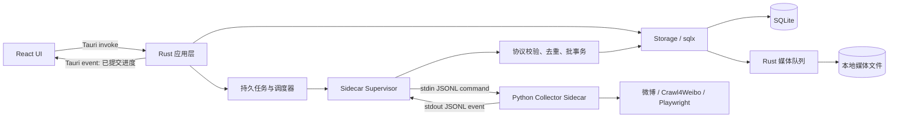

# WeiBack 混合架构改进计划

> 状态：提案（待实施）  
> 首期平台：Windows x64  
> 主产品：`F:\build\weiback-rs\weiback-rs-master`  
> Python 采集器：`F:\build\projects\weiback-python`  
> 最后更新：2026-08-01

## 1. 目标

在保留现有 Rust/Tauri 桌面应用、SQLite 存储、微博展示和媒体能力的基础上，引入 Python Sidecar 复用 `crawl4weibo` 与 Playwright 的采集能力，补齐以下功能：

- 用户微博持续同步与分层刷新。
- 长文、转发、话题、@、位置等更完整的帖子数据。
- 一级评论抓取和二级评论按需抓取。
- 可持久化、可暂停、可重试、可在崩溃后续传的任务。
- 统一媒体队列、失败重试、本地优先和远程回退。
- 同步中心、帖子详情、评论树和组合筛选。

本计划的核心不是把两个现有应用直接拼接，而是明确职责边界，只复用 Python 中难以替代的网络采集能力。

## 2. 范围与非目标

### 2.1 首期范围

- 仅发布和验收 Windows x64。
- Tauri 2 负责打包和管理 Python Sidecar。
- Rust 是产品 SQLite 的唯一读写方和迁移所有者。
- Python 通过 stdin/stdout JSON Lines 传输规范化采集事件。
- React 只调用 Tauri command、订阅 Tauri event，不直接连接 Python。
- Playwright Chromium 先采用按需安装，并提供安装进度、失败重试和诊断信息。
- 新版以永久独立应用身份 `WeiBack Next` 与旧版并行安装和运行。
- 旧版数据仅通过一次性只读快照导入，新旧应用不共享运行目录，也不持续同步。

### 2.2 非目标

- 首期不同时支持 macOS、Linux 或 Windows ARM64。
- 不把 Python 的 FastAPI、Jinja Web UI 或 APScheduler 嵌入桌面应用。
- 不允许 Python 直接读写产品 SQLite。
- 不在首期把全部微博采集能力重写为 Rust。
- 不以 HTTP 本机服务代替 stdio IPC。
- 不在统一媒体表上线时立即删除旧 `picture`、`video` 表。
- 视频首期只保证保存远程 URL，不承诺全部下载到本地。
- 不把 `weiback_v2.db` 之类的文件名当作版本或隔离机制；schema 版本只由 migration 管理。
- 不提供旧版与新版之间的重复增量导入或双向同步。
- 不迁移旧版登录 session；新版使用独立登录态。

## 3. 已确认现状

### 3.1 Rust/Tauri 主产品

- 已有 Tauri 2 + React 桌面 UI，以及稳定的 Tauri command API 边界。
- 已有 Rust `Storage`、sqlx migrations、帖子 FTS、导出和本地媒体读取能力。
- 已有图片、头像、emoji、Live Photo 等媒体提取和下载逻辑。
- 任务管理当前为单进程内存状态，应用重启后丢失。
- 数据库缺少评论、统一媒体、监控用户、同步历史和采集 checkpoint。
- `tauri.conf.json` 尚未配置 `externalBin`，capabilities 尚未开放 Sidecar 执行权限。
- 当前产品名为 `weiback-rs`、Tauri identifier 为 `com.weiback.app`，不满足新旧安装器永久共存要求。
- 当前数据库、配置、session、图片、视频和日志仍分别硬编码在 `weiback` 数据或配置目录中。
- 发布版没有 8080 服务；`1420/1421` 仅为 Vite 开发端口，Sidecar 目标通信方式不占网络端口。
- 当前更新检查固定指向 `Shapooo/weiback-rs`，新版发布前必须切换到独立更新源。

### 3.2 Python 采集器

- 已实现用户微博、一级评论、二级评论、长文及部分续传逻辑。
- 已实现评论树字段和评论分页游标。
- 当前采集器直接调用 Python writer 写入自己的 SQLite schema。
- 当前 daemon 使用 APScheduler，任务状态主要在单进程内存中。
- 当前 PyInstaller spec 包含 FastAPI、Jinja、APScheduler 和 Web UI，作为 Sidecar 过重。
- Playwright Chromium 当前可能在首次运行时联网下载。
- 当前代码没有完整的 JSONL Sidecar 协议、统一指数退避和明确的 Cookie 管理接口。

## 4. 目标架构



### 4.1 职责边界

| 层 | 负责 | 不负责 |
|---|---|---|
| React | 配置、任务控制、可信进度、浏览和错误展示 | Sidecar 通信、数据库写入 |
| Rust/Tauri | 进程生命周期、协议校验、SQLite、迁移、任务、checkpoint、调度、媒体下载 | 复刻全部动态微博解析逻辑 |
| Python Sidecar | 登录态使用、网络请求、页面/API 解析、规范化事件输出 | 产品数据库、任务调度、媒体下载、Web UI |
| SQLite | 产品数据、任务状态、游标、幂等记录 | 临时进程内状态 |

### 4.2 不可破坏的约束

1. Rust 是产品 SQLite 的唯一 writer。
2. sqlx migrations 是 schema 版本的唯一事实来源。
3. Sidecar stdout 只允许输出 JSONL 协议消息，普通日志只能写 stderr。
4. UI 进度表示“Rust 已成功提交的数据”，不能表示“Python 已输出的数据”。
5. 抓取数据和 checkpoint 必须在同一 Rust 数据库事务中提交。
6. 所有数据事件必须幂等；重放不得产生重复业务数据。
7. Sidecar Cookie、令牌及原始敏感响应不得写入 stdout 或普通日志。

### 4.3 应用身份与共存边界

新版采用永久独立身份，不把 `Next` 视为发布稳定后需要撤销的临时后缀：

| 标识 | 新版固定值 |
|---|---|
| 产品名 | `WeiBack Next` |
| Tauri identifier | `com.weiback.next` |
| Rust binary | `weiback-next` |
| Windows 可执行文件 | `weiback-next.exe` |
| 数据与配置命名空间 | `weiback-next` |
| 窗口标题与快捷方式 | `WeiBack Next` |
| Sidecar 基础名 | `weiback-collector`，由 Tauri 按 target triple 选择实际文件 |

新版的默认运行目录必须整体隔离：

```text
旧版：
  data/weiback/
    weiback.db
    pictures/
    videos/
    weiback.log
  config/weiback/
    config.toml
    session.json

新版：
  data/weiback-next/
    weiback.db
    media/
    logs/
    sidecar/
    chromium/
    imports/
  config/weiback-next/
    config.toml
    session.json
```

约束：

1. 新版不得搜索、读取或回写旧版 `weiback/config.toml` 作为运行配置。
2. 新版数据库在独立目录内仍命名为 `weiback.db`；文件名不承担 schema 版本职责。
3. 新旧应用不得共享数据库、配置、session、日志、媒体下载目录、Sidecar 状态或 Chromium 缓存。
4. Windows 首期保持 Tauri 默认的 per-user 安装模式；不假设安装在 `C:\Program Files`，也不要求管理员权限。
5. 发布版使用 JSONL stdio，不启动 8080 或其它本地 HTTP 服务。开发时如需同时运行两个 Vite 实例，再单独分配开发端口。
6. 新版必须使用独立的 GitHub 仓库、Release 页面、更新检查地址和对应 HTTP capability 白名单。
7. 卸载或重置任一应用不得删除另一应用的文件。
8. 两个应用使用同一微博账号时仍共享上游限流额度；新版首次启用自动同步前必须提示避免两边同时采集。

## 5. JSONL 协议 v1

### 5.1 传输约束

- 编码：UTF-8。
- 帧格式：每行一个完整 JSON 对象，以 `\n` 结束。
- stdout：仅协议消息。
- stderr：结构化诊断日志，禁止认证秘密。
- 单条消息设置大小上限；超限时 Sidecar 应拆批，Rust 应拒绝异常消息。
- Rust 必须逐行解析，单条非法 JSON 不得污染数据库。
- 首次握手必须协商 `protocol_version` 和 capabilities。

### 5.2 Rust 到 Sidecar 的命令信封

```json
{
  "protocol_version": 1,
  "request_id": "0198...uuid-v7",
  "type": "collect_comments",
  "payload": {
    "post_id": "123456",
    "checkpoint": {
      "max_id": 987654,
      "max_id_type": 0
    }
  }
}
```

首期命令：

- `hello`：协议和能力握手。
- `health`：运行状态、浏览器和认证状态检查。
- `collect_user_posts`：抓取用户微博。
- `collect_comments`：抓取一级评论。
- `collect_comment_replies`：抓取指定根评论的二级评论。
- `cancel`：请求取消指定 `request_id`。
- `shutdown`：受控退出 Sidecar。

### 5.3 Sidecar 到 Rust 的事件信封

```json
{
  "protocol_version": 1,
  "request_id": "0198...uuid-v7",
  "event_id": "0198...uuid-v7",
  "type": "comment",
  "stream": "post:123456:comments",
  "sequence": 42,
  "total_expected": 500,
  "occurred_at": "2026-07-31T12:34:56.789Z",
  "payload": {}
}
```

字段定义：

| 字段 | 必填 | 语义 |
|---|---:|---|
| `protocol_version` | 是 | 整数协议版本；首期固定为 `1` |
| `request_id` | 是 | 一次 Rust 采集请求的关联 ID |
| `event_id` | 是 | 单个事件的全局幂等键，UUID v7 |
| `type` | 是 | 事件类型 |
| `stream` | 事件相关 | 逻辑资源流，如 `user:123:posts`、`post:456:comments` |
| `sequence` | 流事件相关 | 同一请求、同一 stream 内从 1 开始单调递增 |
| `total_expected` | 否 | 当前可见总数的估算，可为 `null`，不可作为完成判据 |
| `occurred_at` | 是 | Sidecar 生成事件的 UTC 时间，仅用于诊断 |
| `payload` | 是 | 事件类型对应的数据 |

### 5.4 事件类型

- `ready`：Sidecar 启动完成。
- `capabilities`：支持的协议、采集能力和运行依赖状态。
- `started`：请求已开始。
- `progress`：非持久化的阶段信息，例如登录或解析状态。
- `user`：规范化用户数据。
- `post`：规范化帖子数据。
- `comment`：规范化评论数据。
- `media_reference`：媒体 URL、所有者和媒体类型，不含下载结果。
- `checkpoint`：可持久化远端游标和抓取计数。
- `rate_limited`：限流、可重试时间和响应分类。
- `auth_required`：登录态失效或缺失。
- `warning`：不阻断当前请求的可诊断异常。
- `error`：请求失败，包含稳定错误码和可重试属性。
- `done`：明确完成当前 stream 或请求。
- `cancelled`：取消已生效。

### 5.5 Checkpoint 事件

```json
{
  "protocol_version": 1,
  "request_id": "0198...uuid-v7",
  "event_id": "0198...uuid-v7",
  "type": "checkpoint",
  "stream": "post:123456:comments",
  "sequence": 50,
  "total_expected": 500,
  "occurred_at": "2026-07-31T12:35:02.000Z",
  "payload": {
    "cursor": {
      "max_id": 987654,
      "max_id_type": 0
    },
    "fetched_count": 50,
    "has_more": true,
    "reason": "page_completed"
  }
}
```

Checkpoint 规则：

1. 优先在每个远端 API 页面完整解析后发送。
2. 大页面可以每 100 条或每 5 秒追加 checkpoint，但不得越过已发送数据。
3. checkpoint 必须出现在其覆盖的数据事件之后。
4. Rust 缓冲本批数据，并在同一事务中写入业务数据、事件幂等键和 checkpoint。
5. 只有事务提交成功后，Rust 才向 React 发布新进度。
6. 重启 Sidecar 时，Rust 从 SQLite 读取最后已提交 cursor 并传给新请求。
7. `sequence` 用于检测缺失、重复和乱序；真正的恢复依据是 cursor。

### 5.6 完成事件

```json
{
  "protocol_version": 1,
  "request_id": "0198...uuid-v7",
  "event_id": "0198...uuid-v7",
  "type": "done",
  "stream": "post:123456:comments",
  "sequence": 488,
  "total_expected": 500,
  "occurred_at": "2026-07-31T12:40:00.000Z",
  "payload": {
    "status": "completed",
    "fetched_count": 487,
    "has_more": false
  }
}
```

`sequence == total_expected` 不能作为完成条件。总数可能缺失、变化、受权限限制，只有 `done.payload.has_more == false` 或明确的范围完成状态才可结束任务。

### 5.7 错误模型

```json
{
  "type": "error",
  "payload": {
    "code": "UPSTREAM_RATE_LIMITED",
    "message": "Request rate limited",
    "retryable": true,
    "retry_after_ms": 60000,
    "scope": "request"
  }
}
```

首期稳定错误码至少包括：

- `PROTOCOL_VERSION_UNSUPPORTED`
- `INVALID_COMMAND`
- `INVALID_CHECKPOINT`
- `AUTH_REQUIRED`
- `UPSTREAM_RATE_LIMITED`
- `UPSTREAM_UNAVAILABLE`
- `RESPONSE_SCHEMA_CHANGED`
- `BROWSER_NOT_INSTALLED`
- `BROWSER_START_FAILED`
- `REQUEST_CANCELLED`
- `INTERNAL_ERROR`

## 6. 数据模型与迁移

### 6.1 Schema 所有权

- 所有新表和字段均由 Rust sqlx migration 创建。
- 禁止在 Sidecar 中执行 DDL 或使用 `PRAGMA user_version` 管理产品库。
- migration 执行前创建可恢复备份。
- migration 失败时保留原库，不以半迁移库替换。

### 6.2 帖子扩展字段

计划为 `posts` 增加：

- `bid`
- `location`
- `topic_ids`
- `at_users`
- `is_long_text`
- `video_url`
- `raw_data`
- `content_status`
- `fetch_error`
- `first_fetched_at`
- `last_refreshed_at`

结构化集合字段是否拆表，应在 migration 编写前根据现有查询需求确定；不为尚不存在的查询提前复杂化。

### 6.3 新实体

| 实体 | 用途 |
|---|---|
| `comments` | 一级/二级评论、父子关系、作者、正文和时间 |
| `media` | 所有者、URL、本地路径、状态、重试和错误 |
| `monitored_users` | 监控用户、刷新策略和启停状态 |
| `sync_jobs` | 持久任务定义、优先级、调度配置 |
| `sync_runs` | 每次执行的状态、统计、错误和时间 |
| `sync_checkpoints` | stream cursor、已抓取数、最后提交序号 |
| `processed_events` | `event_id` 幂等去重，可按保留策略清理 |

### 6.4 任务状态

```text
pending -> running -> completed
                  -> failed
                  -> paused
                  -> cancelled
running --进程退出--> interrupted -> pending/running
```

- 应用启动时将遗留 `running` 转为 `interrupted`。
- 自动恢复必须读取已提交 checkpoint。
- 任务 run 的生命周期与 checkpoint 生命周期分离；一个 run 失败不删除可续传游标。

### 6.5 媒体兼容迁移

1. 新 `media` 表先作为队列和新写入的事实来源。
2. migration 从旧 `picture`、`video` 回填媒体元数据。
3. 现有 Storage 和 UI 先保持旧表可读，逐步切换为双读或兼容投影。
4. UI 和导出全部切换并通过兼容测试后，再单独决策是否删除旧表。
5. 新下载采用 `.part` 临时文件，校验后原子替换目标文件。
6. 媒体失败不得回滚已经成功持久化的帖子或评论。

### 6.6 旧版一次性快照导入

旧 Rust WeiBack 数据库和 Python v2 数据库都不得原地升级。新版只支持一次性只读快照导入，导入完成后新旧应用各自维护独立历史，不做重复增量合并或双向同步。

首次启动检测到旧版数据时提供：

- `导入旧版数据`
- `全新开始`
- `稍后处理`

导入流程：

1. 提示用户暂停旧版同步任务，并说明导入后两边数据会分叉。
2. 以只读方式识别源类型、schema 版本和媒体根目录。
3. 使用 SQLite backup API 创建一致性源快照，禁止直接复制正在使用的数据库及其未合并 WAL。
4. 在 `weiback-next/imports/` 创建临时目标库并执行最新 Rust migrations。
5. 按源类型分批映射用户、帖子、收藏、评论、媒体和可兼容的同步游标。
6. 将媒体复制到新版独立目录；不得引用、移动或删除旧版媒体文件。
7. 校验行数、外键、FTS、转发关系、媒体路径和抽样正文。
8. 若新版已有数据库，先创建可恢复备份；仅在全部校验通过后原子启用临时目标库。
9. 记录源库规范化路径、源类型、文件指纹、导入时间、版本和统计结果，防止误把同一快照再次导入。
10. 导入失败时删除临时目标并保留诊断信息，旧库和当前新版库保持不变。

默认不导入：

- 旧版 `session.json`、Cookie 或其它认证秘密，新版要求重新登录。
- 未经字段映射评审的配置项，只迁移明确兼容的用户偏好。
- 旧版任务的瞬时 `running` 状态；仅迁移有稳定语义的 checkpoint。

导入完成不是持续同步关系。首期 UI 不提供“再次合并旧版新增数据”入口。

## 7. Sidecar 生命周期与分发

### 7.1 Tauri 接入

- 使用 `bundle.externalBin` 打包 Sidecar。
- Windows x64 文件按 Tauri target triple 规则命名。
- 引入 `tauri-plugin-shell`。
- capabilities 仅允许执行指定 Sidecar，不开放任意 shell。
- Rust 应用启动后按需拉起一个长生命周期 Sidecar，避免每页重复启动。

### 7.2 Supervisor 行为

- 启动后等待 `ready` 和 `capabilities`，握手超时则终止进程。
- 校验协议版本，不兼容时阻止真实采集并显示可操作错误。
- 按 `request_id` 路由并发请求；首期可以限制采集并发，但协议不得依赖全局单任务。
- 独立消费 stdout 与 stderr，避免缓冲区阻塞子进程。
- 支持取消、优雅关闭、无响应超时和强制终止。
- 意外退出后记录退出码，将运行任务标记为 `interrupted`，按退避策略重启。
- 限制自动重启频率，避免崩溃循环。

### 7.3 Python 瘦身

新建专用 headless 入口和 PyInstaller spec：

- 保留 `crawl4weibo`、Playwright、必要解析与协议模块。
- 移除 FastAPI、Uvicorn、Jinja、APScheduler、模板和 Python 媒体下载器依赖路径。
- 将 collector 从“调用 writer”改为“生成规范化事件”。
- 将上游异常分类为稳定协议错误码。
- 对请求采用随机抖动、指数退避并尊重上游 `Retry-After`。

### 7.4 Chromium 策略

首期采用按需安装：

- `health/capabilities` 返回浏览器安装状态。
- UI 明确展示下载大小、进度、失败原因和重试入口。
- 安装不能阻塞数据库浏览、导出等离线功能。
- 浏览器版本应与打包的 Playwright 版本匹配。
- 发布前在无 Python、无 Chromium 的干净 Windows x64 环境验收。

正式发布前重新评估预捆绑 Chromium；预捆绑可提升可预测性，但会显著增加安装包体积。

## 8. 同步与刷新策略

### 8.1 分层刷新

| 层级 | 对象 | 默认策略 |
|---|---|---|
| 热 | 最近帖子、活跃评论、当前手动任务 | 短周期刷新 |
| 温 | 一段时间内有变化的历史帖子 | 较长周期刷新 |
| 冷 | 长期无变化的旧帖子 | 默认不刷新或低频抽查 |

实际周期必须可配置并带随机抖动。收到限流后按账号和端点维度退避，不能立即密集重试。

### 8.2 评论策略

- 一级评论可以随帖子同步或由用户单独触发。
- 二级评论默认按需抓取，用户展开根评论时触发。
- 已完整抓取的评论流不重复请求，除非用户刷新或策略判定需要更新。
- UI 显示已入库数量、估算总数、是否仍有更多、错误和重试状态。

### 8.3 进度口径

- `received_count`：Rust 已解析但尚未提交的数量，仅诊断使用。
- `committed_count`：SQLite 已提交数量，是 UI 主进度。
- `total_expected`：可空估算值。
- `has_more`：远端游标是否仍可继续。
- 完成状态：由 `done` 和已提交事务共同决定。

## 9. UI 改进

### 9.1 同步中心

在现有在线备份页面基础上演进，不另建重复入口：

- 监控用户列表和立即同步。
- 最近任务、状态、已提交进度、下次计划时间。
- 暂停、继续、取消、重试。
- Sidecar 健康、认证和 Chromium 安装状态。
- 限流、登录失效和响应格式变化的明确提示。

### 9.2 帖子详情与评论

- 新增独立 `/posts/:id` 路由。
- 复用现有 `PostDisplay`，不创建第二套正文渲染器。
- 详情页展示完整字段、媒体状态和评论树。
- 一级评论默认加载本地数据。
- 展开二级评论时按需同步，显示 checkpoint 进度和失败重试。

### 9.3 筛选

扩展现有查询 DTO 和 Rust 查询，而不是在前端对分页结果二次过滤：

- 内容类型。
- 本地媒体状态。
- 同步状态。
- 评论抓取状态。
- 现有用户、日期、收藏、关键词和排序条件的组合。

## 10. 实施阶段

### P0-0：应用身份与共存基线（第 1 周前半）

交付物：

- [x] 将永久产品身份改为 `WeiBack Next`、`com.weiback.next` 和 `weiback-next`。
- [x] 将数据库、配置、session、日志、媒体、Sidecar、Chromium 和导入临时文件全部迁入 `weiback-next` 命名空间。
- [x] 删除新版对旧 `weiback/config.toml` 的隐式查找和回写。
- [x] 保持 Windows per-user 安装，并验证安装器不会把新版识别为旧版升级（NSIS `installMode: currentUser`，身份差异见 ADR-005）。
- [ ] 配置独立项目地址、Release 页面、更新检查地址和 HTTP capability 白名单。（本迭代不实施）
- [x] 实现旧版安装与数据检测，但检测过程不得自动打开写连接或修改旧库（`legacy::detect_legacy_sources` 仅解析文件头）。
- [~] 定义旧 Rust 库和 Python v2 库的一次性快照导入契约及 fixture（检测契约 `LegacyDetection` 与两类 fixture 已就绪；快照 payload 输出格式随 P0-A 协议定义一并完成）。
- [x] 首次启用新版自动同步前提示同账号双应用并发采集的限流风险（首启向导 + 设置页提示）。

完成门槛：

1. 新旧应用可以同时安装、启动和独立升级。
2. 修改任一应用配置、session、日志、媒体或数据库不会影响另一应用。
3. 卸载或重置任一应用不会删除另一应用及其数据。
4. 新版更新检查不会指向旧版仓库或 Release。
5. 导入检测与失败流程不会修改旧版数据。
6. 新版发布进程不监听 8080 或其它本地 HTTP 端口。

### P0-A：基线、ADR 与协议（第 1 周前半）

交付物：

- [x] 记录 Rust 和前端现有测试基线；Python Sidecar 建立后补充 Python 基线。
- [x] 确认主项目 Git 边界，避免构建产物或相邻项目误入版本控制。
- [x] 建立 ADR：混合架构、Rust 单 writer、JSONL stdio、Windows x64 首发、永久独立身份、一次性快照导入（`docs/adr/ADR-001..006`）。
- [x] 将协议消息定义为 JSON Schema 或等价的可验证类型（`docs/protocol/v1/`：command/event/dtos schema + errors.md）。
- [x] 建立帖子、评论、checkpoint、错误的黄金 fixture（`fixtures/`，已验证逐行合法 JSONL）。
- [x] 明确敏感字段和日志脱敏规则（`docs/security.md`）。

完成门槛：

- 协议 v1 字段和数据库映射经过评审。
- Python fixture 可被 Rust 解析，Rust 命令 fixture 可被 Python 解析。
- 不需要真实微博网络即可运行契约测试。

### P0-B：Sidecar 骨架（第 1 周）

交付物：

- [ ] Python headless JSONL 入口。
- [ ] `hello/health/cancel/shutdown` 命令。
- [ ] `ready/capabilities/started/error/done` 事件。
- [ ] Rust Sidecar supervisor 和协议解析器。
- [ ] Tauri `externalBin`、shell plugin 和最小 capabilities。
- [ ] fixture 驱动的假采集流。

完成门槛：

- Windows x64 可启动打包后的 Sidecar 并完成握手。
- 无效 JSON、协议不兼容、退出码异常和握手超时均返回可诊断错误。
- stdout/stderr 并行消费，不发生子进程阻塞。

### P0-C：Rust 数据模型与迁移（第 1 至 2 周）

交付物：

- [ ] migration 前备份和失败恢复测试。
- [ ] 帖子完整字段。
- [ ] 评论、媒体、监控用户、任务、run、checkpoint、幂等事件表。
- [ ] Storage DTO、round-trip 和查询扩展。
- [ ] 数据事件 + checkpoint 同事务提交。
- [ ] 旧 Rust 数据库 fixture 升级测试。

完成门槛：

- 旧库升级后帖子、用户、收藏、FTS 和媒体引用不丢失。
- 重复 `event_id`、重复业务主键和重复 checkpoint 不产生重复数据。
- migration 失败时原库可正常打开。

### P1-A：Python 事件抽取（第 2 周）

交付物：

- [ ] collector 与 Python writer 解耦。
- [ ] 用户、帖子、评论、媒体引用规范化事件。
- [ ] 两种已知 `hotFlowChild` 响应格式 fixture。
- [ ] 分页后 checkpoint。
- [ ] 异常分类、指数退避、随机抖动和认证状态。
- [ ] Sidecar 专用瘦 PyInstaller spec。

完成门槛：

- 现有采集 fixture 全部通过协议契约测试。
- Sidecar 不加载 FastAPI、模板、APScheduler 或媒体下载职责。
- stdout 不出现日志或 Cookie。

### P1-B：真实采集垂直切片（第 2 至 3 周）

交付物：

- [ ] Rust 发起真实用户帖子采集。
- [ ] Python 输出数据和逐页 checkpoint。
- [ ] Rust 批事务写入并发布可信 Tauri 进度。
- [ ] 一级评论和二级评论按需采集。
- [ ] Sidecar 崩溃和应用重启后的续传。

完成门槛：

1. 强制终止 Sidecar 后，任务被标记为 `interrupted`。
2. 重启后从最后已提交 cursor 继续。
3. 已提交页不丢失、不重复。
4. 认证失效和限流不会损坏任务或数据库。

### P2：持久任务与智能刷新（第 3 周）

交付物：

- [ ] 持久任务队列和 run 历史。
- [ ] 暂停、继续、取消、重试。
- [ ] 监控用户和分层刷新。
- [ ] 按账号/端点限流、指数退避和随机抖动。
- [ ] 应用启动时恢复 interrupted 任务。

完成门槛：

- 所有跨 session 状态均在 SQLite 中恢复。
- 连续崩溃不会形成无限重启循环。
- 同一资源不会因多个调度项并发重复抓取。

### P3-A：统一媒体流水线（第 4 周）

交付物：

- [ ] Sidecar 只输出 `media_reference`。
- [ ] Rust 先提交正文与 `pending` 媒体记录。
- [ ] Rust 后台下载头像、图片和评论图。
- [ ] `.part` 写入、原子替换、重试和清理。
- [ ] 本地优先、远程回退及失败状态展示。
- [ ] 旧 `picture/video` 兼容读取和回填测试。

完成门槛：

- 媒体下载失败不影响正文可见性。
- 断网后本地媒体可浏览，缺失媒体显示明确状态。
- 重启后 pending/failed 队列可继续处理。

### P3-B：UI 增强（第 4 周）

交付物：

- [ ] 同步中心。
- [ ] 任务历史和控制。
- [ ] 独立帖子详情路由。
- [ ] 评论树、二级评论按需加载。
- [ ] 组合筛选。
- [ ] Chromium 安装、Sidecar、认证和限流诊断 UI。

完成门槛：

- UI 所有进度均来自 Rust 已提交状态。
- 评论展开不会重复触发同一运行中请求。
- 窄窗口和常用桌面尺寸无文本溢出或操作遮挡。

### P4：兼容、故障注入与发布门禁

交付物：

- [ ] 旧 Rust 数据库和 Python v2 数据库导入器及 fixture。
- [ ] Sidecar kill、应用 kill、429、认证失效、响应变更、磁盘满和迁移失败测试。
- [ ] Windows x64 干净环境安装测试。
- [ ] 新旧安装包并存、独立更新和交叉卸载测试。
- [ ] 安装包签名、Sidecar 完整性和版本匹配检查。
- [ ] 用户数据备份、恢复和回滚说明。

完成门槛：

- 迁移和导入均经过备份、校验、失败回滚演练。
- 无开发环境的 Windows x64 机器可安装、启动、安装 Chromium、同步、重启续传和离线浏览。
- 发布包不包含开发服务器、模板或无关 Python 依赖。
- 新版安装、运行、更新、重置和卸载均不改变旧版程序或数据。

## 11. P0 最小垂直切片

在接入真实 `crawl4weibo` 请求前，必须先完成以下闭环：

1. Rust 启动 Windows x64 Python Sidecar。
2. 双方完成协议版本和能力握手。
3. Rust 发送一个基于 fixture 的采集请求。
4. Python 连续输出 `post` 和 `checkpoint`。
5. Rust 校验 sequence，并幂等写入 SQLite。
6. Rust 提交事务后向 React 发布可信进度。
7. 强制终止 Sidecar，重启后从最后 checkpoint 继续。
8. 协议不兼容、无效 JSON 和进程退出均产生可诊断错误且不损坏数据库。

这是进入真实网络采集的强制门禁，不能以临时内存状态替代。

## 12. 验证策略

### 12.1 Python 契约测试

- Crawl4Weibo 对象到规范 DTO 的逐字段验证。
- 长文、转发、删除/不可见内容和缺失字段。
- 一级评论和两种二级评论响应 envelope。
- cursor、`has_more`、总数未知和总数变化。
- 上游异常到稳定错误码的映射。
- stdout 无日志、stderr 无认证秘密。

### 12.2 Rust migration 与 Storage 测试

- 旧库迁移前备份。
- 新字段逐字段 round-trip。
- 评论父子树和删除行为。
- media 状态转换和旧表回填。
- FTS trigger 和旧帖子搜索结果。
- 重复事件、乱序事件和 checkpoint 回放。
- 数据批次与 checkpoint 的事务原子性。

### 12.3 IPC 集成测试

- 握手成功、版本不兼容和能力缺失。
- 空行、非法 JSON、未知事件和超大消息。
- 重复、跳号、乱序 sequence。
- Sidecar 正常退出、崩溃、挂起和 stderr 洪水。
- cancel 与 done/cancelled 的竞争。
- Rust 进程重启后重新握手和恢复。

### 12.4 恢复测试

- 每页提交后立即 kill Sidecar。
- checkpoint 输出后、事务提交前 kill 应用。
- 事务提交后、UI 收到事件前 kill 应用。
- 重启后验证无重复、无丢失并从正确 cursor 继续。
- 遗留 `running` 状态正确转换为 `interrupted`。

### 12.5 UI 测试

- 组合筛选由后端查询正确执行。
- 帖子详情复用正文展示并支持直达路由。
- 评论展开只触发一次活动请求。
- 本地媒体、远程回退、pending 和 failed 状态。
- 任务暂停、继续、取消和重试。
- Sidecar、Chromium 和登录异常的用户可操作反馈。

### 12.6 共存与导入测试

- 在已安装旧版的 Windows x64 环境安装、启动、升级和卸载新版。
- 新旧应用同时运行时，配置、数据库、session、日志、媒体和 Chromium 目录无共享写入。
- 旧库处于 WAL 模式且旧版已运行时，通过 SQLite backup API 获得一致快照。
- 旧 Rust 库和 Python v2 库分别完成逐字段导入、FTS 校验和媒体复制。
- 在快照创建、数据映射、媒体复制、校验和原子替换各阶段注入失败，验证旧库及原新版库不变。
- 相同源指纹不会被误导入第二次。
- 不导入旧 session，新版要求独立登录。
- 重置和卸载新版只作用于 `weiback-next` 命名空间。
- 新版更新链接、项目链接及 capability 白名单全部指向独立发布源。

## 13. 可观测性与安全

### 13.1 日志

- 每次运行关联 `request_id`、`run_id`、`stream`。
- Rust 记录进程启动、握手、事务提交、checkpoint、重试和退出码。
- Python 记录端点、页码、耗时、响应分类，不记录 Cookie 和完整个人数据响应。
- 日志轮转并限制保留期限。

### 13.2 指标

- 请求、接收、提交和跳过重复事件数。
- 每个 stream 的已提交数量和最后 checkpoint 时间。
- 429、认证失败、schema 变化和 Sidecar 重启次数。
- 媒体 pending/downloading/completed/failed 数量。

### 13.3 安全

- capabilities 仅授权已声明 Sidecar。
- Sidecar 路径不可由前端任意传入。
- session 文件位于应用专属数据目录，并限制非必要暴露。
- 导入库、JSONL payload、文件路径和远程 URL 都按不可信输入处理。
- 打包时校验 Sidecar 版本与协议版本，正式发布加入文件哈希或签名检查。

## 14. 风险与缓解

| 风险 | 影响 | 缓解 |
|---|---|---|
| 微博响应结构变化 | 采集失败或字段丢失 | adapter + fixture + `RESPONSE_SCHEMA_CHANGED`，保留原始诊断摘要 |
| 双迁移体系冲突 | 数据损坏 | Rust 单 writer、sqlx 唯一迁移所有者 |
| checkpoint 早于数据提交 | 恢复时永久漏数据 | 数据与 checkpoint 同事务，提交后才发布进度 |
| 重放产生重复 | 数据膨胀或评论重复 | `event_id` + 业务唯一键双重幂等 |
| Sidecar 崩溃循环 | CPU/日志异常 | 有上限的指数退避和熔断状态 |
| Playwright 首次下载失败 | 新用户无法同步 | 健康检查、可见进度、重试和离线功能不受影响 |
| PyInstaller 体积和启动慢 | 安装与体验下降 | 专用瘦 spec，排除 Web 与调度依赖 |
| 过快请求触发限制 | 账号风险和任务失败 | 随机抖动、分层刷新、端点级退避、尊重 Retry-After |
| 统一媒体破坏旧功能 | 图片或导出缺失 | 渐进迁移、旧表兼容读取、独立清理决策 |
| Windows 单平台设计固化 | 后续跨平台成本 | IPC 和数据协议保持平台无关，仅打包层限定 Windows |
| 安装器身份未完全隔离 | 新版覆盖、升级或卸载旧版 | 永久更换 productName、identifier、binary 和快捷方式，并做交叉安装测试 |
| 只改数据库名导致目录共享 | session、媒体、配置或日志互相污染 | 整体使用 `weiback-next` 数据与配置命名空间 |
| 复制活跃 SQLite 文件 | WAL 数据遗漏或快照损坏 | 使用 SQLite backup API 创建一致性只读快照 |
| 用户误解导入为持续同步 | 两边数据分叉或重复导入 | 明确一次性语义、记录源指纹、首期不提供增量合并 |
| 新旧应用同账号同时抓取 | 共享上游额度并更易限流 | 自动同步默认关闭至用户确认，账号/端点退避并显示风险提示 |
| 新版沿用旧更新源 | 用户被引导安装旧版 | 独立仓库、Release、更新地址和 capability 白名单 |

## 15. 架构决策摘要

### ADR-001：采用受控混合架构

- 决策：保留 Rust/Tauri 主产品，以 Python Sidecar 复用成熟采集能力。
- 原因：Python 已覆盖评论、长文和浏览器兜底；立即纯 Rust 重写会重复投入并推迟交付。
- 代价：需要维护跨语言协议、Sidecar 打包和进程诊断。
- 后续：保留采集后端接口，未来可按端点渐进替换为 Rust 实现。

### ADR-002：Rust 是唯一数据库 writer

- 决策：Python 不接触产品 SQLite。
- 原因：避免 SQLite 锁竞争、schema 漂移、迁移归属冲突和任务状态割裂。
- 代价：Rust 必须实现协议校验、批事务和所有新 Storage API。

### ADR-003：使用 JSONL stdio IPC

- 决策：Sidecar 使用 stdin/stdout JSONL，stderr 输出日志。
- 原因：无需本地端口、CORS、服务发现和额外鉴权，适合 Tauri 子进程生命周期。
- 代价：必须严格管理帧、消息大小、stdout 纯净度和背压。

### ADR-004：首期仅 Windows x64

- 决策：先闭合单平台打包、签名、Playwright 和恢复链路。
- 原因：PyInstaller Sidecar 与浏览器均需逐平台构建验证。
- 代价：原 README 中已有的其他桌面平台在新采集能力上暂不对等。

### ADR-005：新版采用永久独立应用身份

- 决策：新版固定使用 `WeiBack Next`、`com.weiback.next`、`weiback-next` 和独立数据命名空间，不在稳定后改回旧身份。
- 原因：确保新旧安装、运行、更新、重置和卸载互不影响，并避免未来再进行一次身份与数据迁移。
- 代价：新版需要独立维护发布渠道、快捷方式、配置和用户登录态。

### ADR-006：旧版数据只做一次性快照导入

- 决策：从旧 Rust 库或 Python v2 库创建一致性只读快照，导入后新旧应用不再自动同步。
- 原因：满足渐进验证和快速回退，同时避免跨 schema 双向同步、冲突合并和共享媒体所有权。
- 代价：导入后两边数据会分叉；需要在向导中明确语义，并要求用户选择主要使用的版本。

## 16. 后续纯 Rust 演进条件

纯 Rust 采集不是当前阶段目标。只有某一端点同时满足以下条件时，才允许替换对应 Python provider：

- 登录、限流、长文、评论和异常行为达到协议等价。
- 与 Python 黄金 fixture 和真实样本进行差异测试。
- 崩溃恢复和 checkpoint 语义不变。
- 可以按配置回退 Python provider。
- 替换后没有降低字段完整性或反爬兼容性。

禁止一次性重写所有采集端点。

## 17. 变更纪律

- 每个阶段先建立失败测试，再提交最小实现。
- migration、协议、Sidecar supervisor、任务恢复和媒体流水线分别提交，避免大批量混合变更。
- 应用身份与目录隔离必须先于数据库 migration 和 Sidecar 接入完成，后续阶段不得再写入旧 `weiback` 命名空间。
- 构建产物、Chromium 缓存、Sidecar dist 和测试数据库不得提交。
- 每完成一个阶段，更新本文件复选框、已知风险和实际验收结果。
- 协议不兼容变更必须提升 `protocol_version`；兼容新增字段不得改变既有字段语义。
